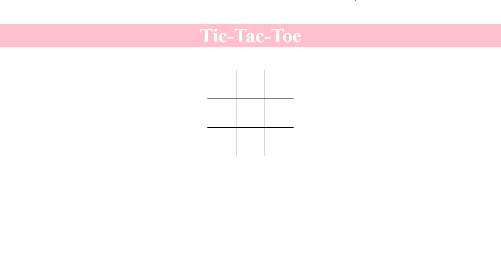

# Tic-Tac-Toe

# Description

Tic-Tac-Toe is a simple web application that uses HTML, CSS, and Javascript to render the x's and o's.

# Link to application

Go to [Tic-Tac-Toe](https://campe0n.github.io/tictactoe/)

# Questions

If you have any questions, you can reach me using these methods.

[Github](https://github.com/campe0n)

Email: melvinrf@Outlook.com
